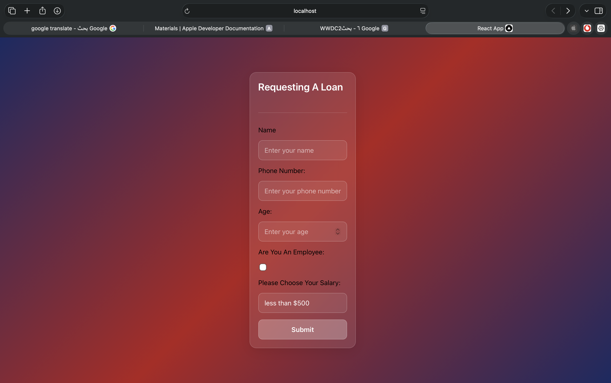
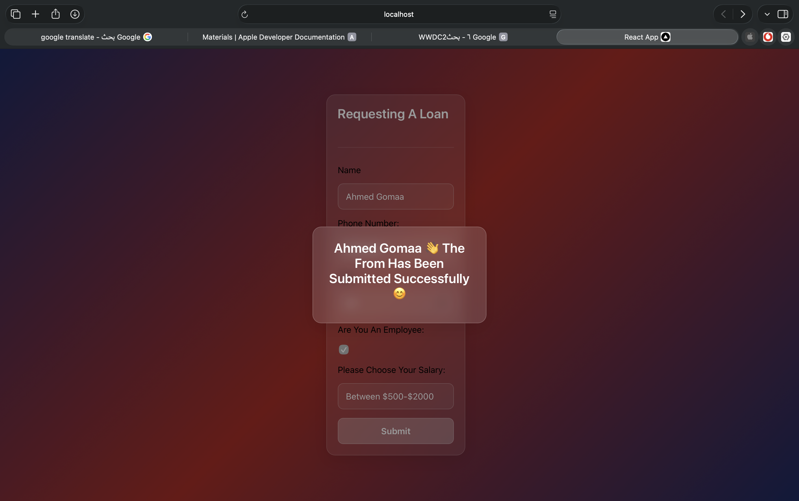

# 🏦 React Loan Form Application

A beautiful, modern loan application form built with React featuring a liquid glass UI design and interactive validation.



## 🚀 Features

- **Responsive Design**: Works on mobile and desktop devices
- **Liquid Glass UI**: Stunning frosted glass effects with blur and transparency
- **Form Validation**: Prevents submission with missing required fields
- **Interactive Feedback**: Success modal with animated emojis upon submission
- **Modern React Hooks**: Uses useState for state management
- **Accessible Form Elements**: Proper labels, placeholders, and input types

## 📱 User Interface

The application features two main screens:

### 1. Loan Application Form
Users can fill out their personal information:
- 👤 **Name**: Text input field
- 📞 **Phone Number**: Telephone input field  
- 🎂 **Age**: Number input field
- 💼 **Employment Status**: Checkbox toggle
- 💰 **Salary Range**: Dropdown selector with three options

### 2. Success Message Modal


After successful form submission, users see a congratulatory modal with:
- Personalized greeting using their name
- Friendly success message with emoji
- Click-to-dismiss functionality

## 🛠️ Technology Stack

- **Frontend**: React 18 with Hooks
- **Styling**: Custom CSS with CSS Variables and Advanced Effects
- **UI Effects**: 
  - Liquid Glass (background blur + transparency)
  - Backdrop-filter for frosted glass effect
  - Smooth transitions and hover effects
  - Box shadows for depth
- **State Management**: React useState Hook
- **Form Handling**: Controlled components with real-time validation

## 🔧 Installation & Setup

1. **Clone the repository**
   ```bash
   git clone https://github.com/Ahmed9030/Loan-Form
   cd loan-form
   ```

2. **Install dependencies**
   ```bash
   npm install
   ```

3. **Start the development server**
   ```bash
   npm start
   ```

4. **Open in browser**
   Visit [http://localhost:3000](http://localhost:3000) to see the application

## 📝 Form Validation Logic

The form implements client-side validation that:
- Prevents submission if Name, Phone Number, or Age fields are empty
- Provides visual feedback through disabled submit button
- Allows free-form input for name and phone
- Restricts age to numeric input only
- Provides predefined salary range options

## 🎨 Design Details

### Liquid Glass Effect
The form uses a combination of:
- `background: rgba(255, 255, 255, 0.1)` for translucency
- `backdrop-filter: blur(20px)` for the frosted glass effect
- `border: 1px solid rgba(255, 255, 255, 0.18)` for subtle definition
- `box-shadow: 0 8px 32px 0 rgba(0, 0, 0, 0.1)` for depth

### Interactive States
- **Input Focus**: Subtle transform and enhanced border on focus
- **Button Hover**: Elevated effect with color change on hover
- **Modal Backdrop**: Semi-transparent dark overlay when modal is active

## 💡 How It Works

1. User fills out the form fields
2. Real-time state updates via `onChange` handlers
3. Submit button disabled until required fields are filled
4. On submit:
   - Form data is captured in state
   - Modal visibility toggled to true
   - Success message displays user's name
5. Clicking anywhere on the modal backdrop closes it

## 📂 Project Structure

```
loan-form/
├── public/
├── src/
│   ├── App.js          # Main application component
│   ├── Loanform.js     # Form logic and rendering
│   ├── Modal.js        # Success modal component
│   ├── fromstyle.css   # Custom liquid glass styling
│   ├── index.js        # Entry point
│   └── ...             # Boilerplate files
├── images/
│   └── README/
│       ├── FormPage.png    # Form interface screenshot
│       └── message.png     # Success modal screenshot
├── package.json
└── README.md
```

## 🌈 Color Scheme & Typography

- **Background**: Animated gradient (`#1a2a63`, `#b21f1f`, `#1a2a63`)
- **Form Elements**: White text with translucent backgrounds
- **Accents**: White highlights and borders
- **Typography:
- **Font Family**: System font stack for optimal rendering
- **Heading Sizes**: Hierarchical scaling for clear visual hierarchy
- **Weights**: Balanced use of regular and semi-bold weights

## ✅ Future Enhancements

Potential improvements for future versions:
- [ ] Form reset after successful submission
- [ ] Email validation for contact information
- [ ] Loan amount calculator
- [ ] Animated form transitions
- [ ] Dark/light theme toggle
- [ ] Form data persistence with localStorage
- [ ] Integration with backend loan processing API

## 🙌 Acknowledgements

- Created with [Create React App](https://github.com/facebook/create-react-app)
- Inspired by modern UI/glassmorphism design trends
- Built as a learning project for React state management and styling

---

*Built with ❤️ using React and modern CSS techniques*
